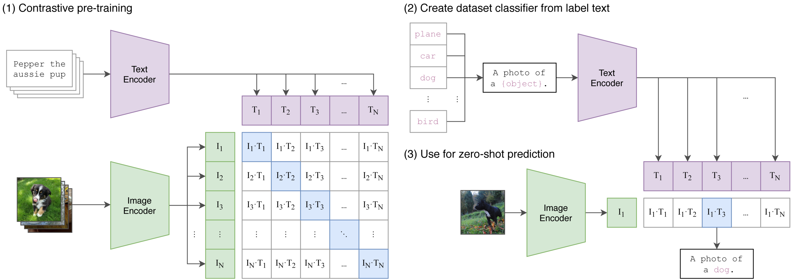

### Disclaimer
This is my first ever post, please excuse any inaccuracies. Any suggestions welcome at strakammm@gmail.com!

## Motivation
Ever since Deep Learning started as a field, we have been observing an __increased performance__ of models
coming from using __bigger datasets__ and __more compute__. One such compute and data demanding architecture, [Transformer](https://arxiv.org/abs/1706.03762),
is used in many State-of-the-Art methods. The architecture properties and recent [scaling laws](https://arxiv.org/abs/2001.08361) indicate that
leveraging large amounts of data should lead to increased performance.

However, the problem with datasets such as [ImageNet](https://arxiv.org/abs/1409.0575) is that __they grow slowly__ and __have a weak annotation__
(usually just one word). On the other hand, websites such as Wikipedia or Instagram, __contain bilions of images__ that
contain __richer annotation__ in form of **captions**. [CLIP](https://arxiv.org/abs/2103.00020), a multi-modal model, leverages these large
annotated datasets to train large vision and language transformers in a fashion from which interesting properties emerge.

### Shared Latent Space
The first interesting property is that CLIP doesn't just learn __arbitrary representations__ of text and images,
but it __embeds them into the same latent space__. This basically means that when we get vector representation from CLIP
for text and for image, we can compute the similarity between using cosine similarity. This enables us to use CLIP
for __text-image retrieval__ or __text conditioning__ in __image generation__ or __image segmentation__.


### Zero-Shot Transfer
The second crucial property of CLIP is that it __unlocks zero-shot transfer__. In practice, instead of encoding image classes
as one-hot vectors, we can encode them simply as *strings*. Then, since CLIP **text encoder can encode any text**, it can
therefore **encode any label** we want. This allows us to use CLIP on our custom labels **without any transfer learning**.
See code down below.

## Method

<a name="diagram_anchor"></a>


### Pre-Training
The training procedure for the CLIP method is very similar to traditional supervised training.
The dataset consists of 400 milion image-text pairs scraped from the internet. 

The architecture leverages one encoder for text and one for images. After obtaining a batch
of N image-text pairs, we obtain embeddings from respective encoders.
These representations are projected by one more linear layer into the **same latent space** where they are
$L_2$ normalized.

From these normalized representations an
$N × N$ **similarity matrix** is created by computing **pair-wise dot-product** 
between every image and text representation.
Then the `softmax` operation is applied to **every row and column**,
creating probability distributions - for each image we
have distribution over all texts and symmetrically for each
text we have distribution over all images. Logits of ground
truth labels are conveniently on the diagonal of the similarity matrix,
from which we compute **cross-entropy loss** and **train both encoders jointly**.



### Downstream adaptation
On the right side of the image above we observe how such model
can be applied to downstream tasks. 
We create **custom labels as strings**, encode them **once** and cache obtained representations. 
Then, when a new image that has to be classified comes in, we obtain its representation and compare
it to cached text embeddings. Since **text encoder can encode any string of characters** to obtain
its representation, **the zero-shot property emerges**.


## Main Results
### Zero-Shot Transfer
Perhaps the most important result of the paper is about its
**zero-shot performance**. Authors stress the importance of
zero-shot evaluation as a way to assess true generalization
strength of Computer Vision models on unseen datasets and
motivate it as measuring **task-learning capabilities**. This is
important because 
*true general models should not need to be adapted to every new task they are presented with*
From the following figure we can see that CLIP is a **very strong zero-shot**
model, outperforming ResNet-50 on majority of datasets:


### Natural Distribution Shift
The study of generalization suggests another concept called
***Natural Distribution Shift***, which measures models’ ability
to classify images from the **same class**, but sampled from
a **different distribution** (dataset). Consider an example of a
banana. In one dataset, we might be presented with a photo
of a banana, but in another, there might be black and white
sketches of it. Humans understand the concept of a sketch
and therefore understand that it does not need to be yellow.
But do Computer Vision models understand it too? 


Authors show
that most Computer Vision models trained on ImageNet are **weak**
in this regard. CLIP, on the other hand, is **able to maintain
its performance** when presented with samples for various distributions,
which hints that it is indeed a **very general model**.

## Roll Your Own Classifier!
The nature of CLIP allows us to create our own classifier very quickly.
Following code is a simple example of how to do it using PyTorch:fire: and HuggingFace🤗:
```python
from PIL import Image

# Import the CLIP model
from transformers import CLIPProcessor, CLIPModel

# Processor tokenizes the labels and prepares images for model
processor = CLIPProcessor.from_pretrained("openai/clip-vit-base-patch32")
# Model actually performs the forward pass and gives predictions
model = CLIPModel.from_pretrained("openai/clip-vit-base-patch32")

# Load our image, which is a panda eating a bamboo stick
image = Image.open('panda.jpg')

# Define our own labels as we want
my_own_labels = [
    "a photo of a panda",
    "a photo of a grizzly bear",
    "a photo of a bamboo",
]

# Prepare inputs for the forward pass
inputs = processor(
    text=my_own_labels, images=image, return_tensors="pt", padding=True
)

outputs = model(**inputs) # Apply forward pass
logits_per_image = outputs.logits_per_image  # Obtain the logits
probs = logits_per_image.softmax(dim=1)  # Convert to probabilities

print(probs)
print(f'This is {my_own_labels[probs.argmax()]}.')
```
which outputs:

`>>> tensor([[7.8885e-01, 1.9084e-04, 2.1096e-01]], grad_fn=<SoftmaxBackward0>)`

`>>> This is a photo of a panda.`

This essentially says that there is a
- ~78.9% that the image is a photo of a panda
- ~0.0001% that the image is a photo of a grizzly bear
- ~21% that the image is a photo of a bamboo

And we can find the correct label using the `argmax` function.
And that is it! This is how you can create your own classifier for your next project!

## Conclusion
In this short post we have motivated and desribed the ***CLIP method***.
The CLIP method is a powerful tool for Computer Vision.
The ideas for pre-training show us how we can leverage vast amounts
of data that is freely available on the internet.
The zero-shot performance gives us a much more representative measure
of generality of Computer Vision models and Deep Learning practitioners
can leverage zero-shot for quickly evaluating new ideas.

## References

- [Attention is all you need](https://arxiv.org/abs/1706.03762)

- [Learning Transferable Visual Models From Natural Language Supervision](https://arxiv.org/abs/2103.00020)

- [Scaling Laws for Neural Language Models](https://arxiv.org/pdf/2001.08361)

- [ImageNet](https://arxiv.org/abs/1409.0575)